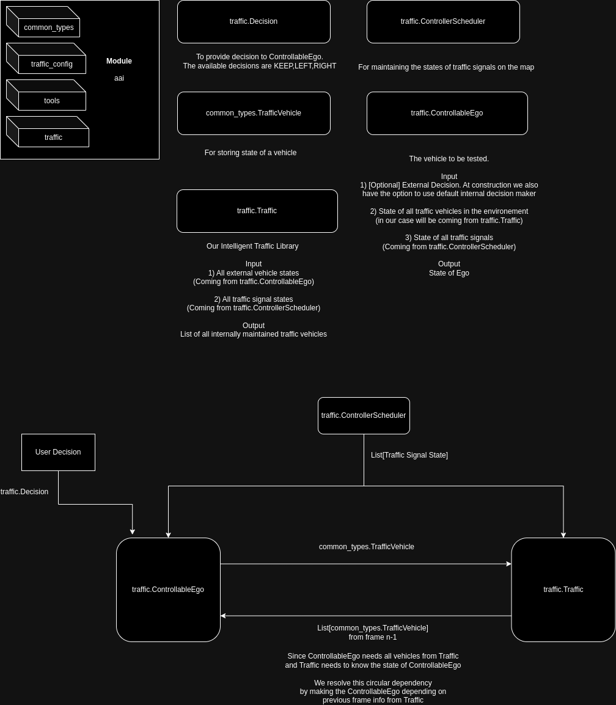
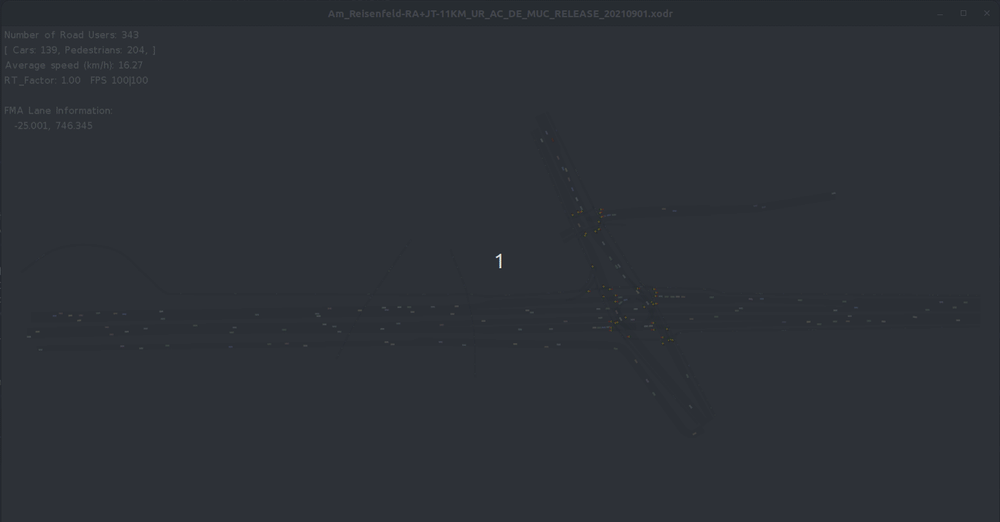

# replicar-lite

Our replicar-lite is designed to empower researchers and city planners with a versatile platform for traffic simulation and analysis. This library provides functionalities to simulate diverse traffic scenarios, enabling users to analyze, optimize, and evaluate traffic behaviors in various contexts.

## Features:
- Naturalistic Nanoscopic Traffic Simulation: Naturalistic traffic simulation where each agent operates with its own independent decision-making process. Agents respond to their surroundings and configuration profiles, influencing their behavior in diverse scenarios.

- Diverse Scenario Simulation: Generate and simulate traffic scenarios, including urban, highway, and customized maps with configurable traffic parameters.

- Object-List Level Simulation: Simulate traffic at an object-list level, enabling low-fidelity testing for Advanced Driver Assistance Systems (ADAS) and Autonomous Driving (AD) functions.

- Machine Learning Model Training: Train machine learning models for decision-making within autonomous systems using simulated traffic data.

- City Planning Support: Design and analyze urban traffic scenarios to optimize traffic flow, identify congestion points, and refine infrastructure.

- Compliance with Open Standards: Ensure compatibility and adherence to industry open standards such as ISO-34502, ASAM Open Drive, and Open Simulation Interface, facilitating seamless integration and interoperability.

## Flow Diagram
This is a simple flow diagram to explain the flow of data between different components.<br/>
The modules and classes are explained further inside example.ipynb as well.<br/> 


## Getting Started:



### Available Versions
Linux (Tested on Ubuntu 22.04.2 LTS)<br/>
Python Versions: 3.6, 3.7, 3.8 

### Installation:
1) Just clone the repo or extract the release package zip
2) Unzip libtensorflow.zip in the root folder of repo

### Usage:
1) Add your_python_env/lib folder path to LD_LIBRARY_PATH env variable for Linux
   If not already present, an example coulde
   ```
      export LD_LIBRARY_PATH=$LD_LIBRARY_PATH:your_python_env/lib
   ```

3) Add the specific module that you want to use to the PYTHONPATH environment variable.<br/>
   For example, if you want to use the python3.6 package for Linux, you should run <br/>
   the following command from the root folder in the repository:
   ```
      export PYTHONPATH=$PYTHONPATH:./packages/python3.6/linux/aai
   ```
   This will make the module accessible to the interpreter

   Note:
   Always use the matching interpreter version. For instance, in the example above,
   the proper Python version should be Python3.6.
   
   For conda
   ```
      conda activate py36_env
   ```   

## Links

- **Website:** [For our complete portfolio](https://www.automotive-ai.com/)
- **YouTube:** [For small sneak peeks](https://www.youtube.com/@automotive-ai)
- **LinkedIn:** [For more updates](https://www.linkedin.com/company/automotive-artificial-intelligence-aai-gmbh/)
- **Support Email:** support@automotive-ai.com
