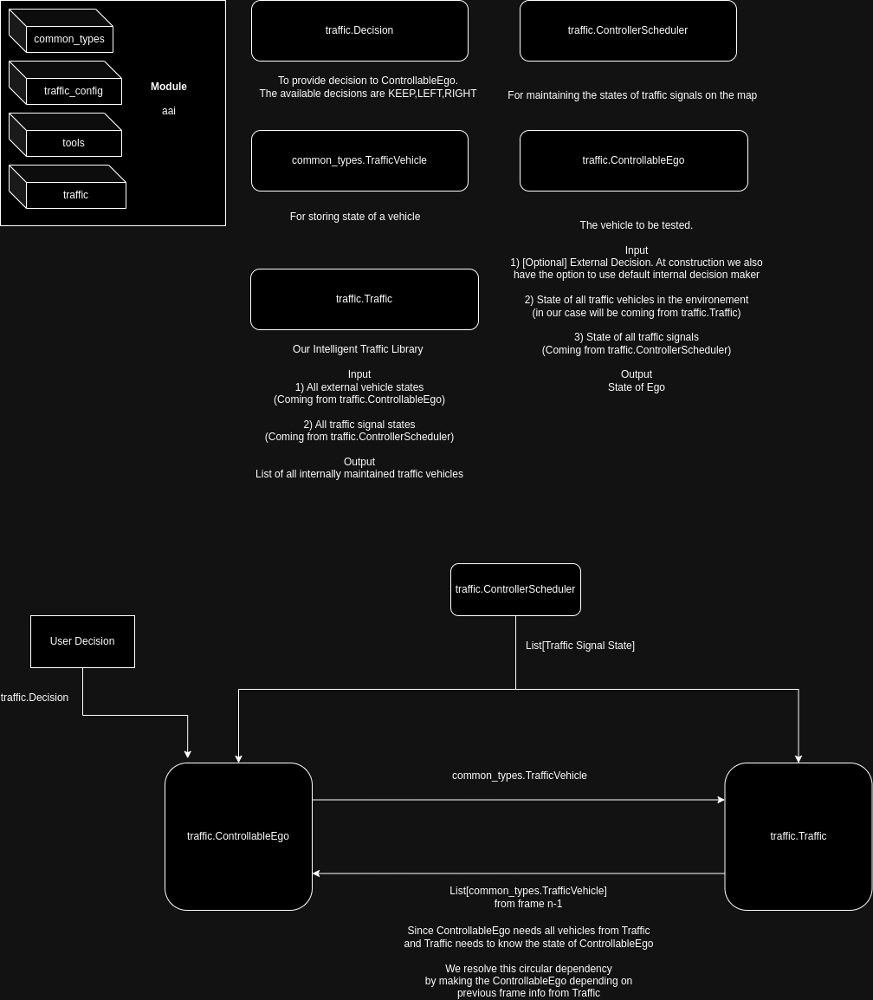
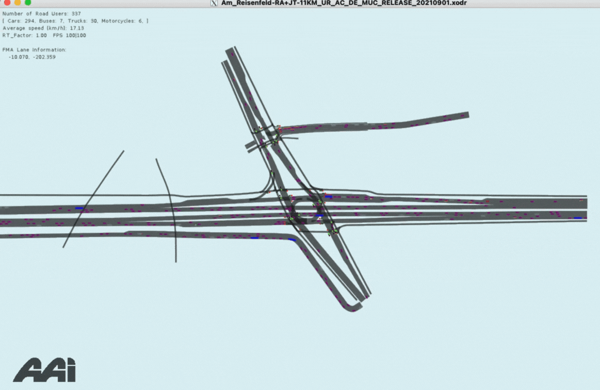

# replicar-lite

Our replicar-lite is designed to empower researchers and city planners with a versatile platform for traffic simulation and analysis. This library provides functionalities to simulate diverse traffic scenarios, enabling users to analyze, optimize, and evaluate traffic behaviors in various contexts.

## Features:
- Naturalistic Nanoscopic Traffic Simulation: Naturalistic traffic simulation where each agent operates with its own independent decision-making process. Agents respond to their surroundings and configuration profiles, influencing their behavior in diverse scenarios.

- Diverse Scenario Simulation: Generate and simulate traffic scenarios, including urban, highway, and customized maps with configurable traffic parameters.

- Object-List Level Simulation: Simulate traffic at an object-list level, enabling low-fidelity testing for Advanced Driver Assistance Systems (ADAS) and Autonomous Driving (AD) functions.

- Machine Learning Model Training: Train machine learning models for decision-making within autonomous systems using simulated traffic data.

- City Planning Support: Design and analyze urban traffic scenarios to optimize traffic flow, identify congestion points, and refine infrastructure.

- Compliance with Open Standards: Ensure compatibility and adherence to industry open standards such as ISO-34502, ASAM Open Drive, and Open Simulation Interface, facilitating seamless integration and interoperability.

## Flow Diagram
This is a simple flow diagram to explain the flow of data between different components.<br/>
The modules and classes are explained further inside example.ipynb as well.<br/> 


## Getting Started:



### Linux (native)

Tested on Ubuntu 22.04.2 LTS. Python versions: 3.6, 3.7, 3.8.

**Installation**
1. Clone the repo or extract the release package zip.
2. Unzip libtensorflow.zip in the root folder of repo.
#### Linux (native)
Linux (Tested on Ubuntu 22.04.2 LTS)<br/>
Python Versions: 3.8

On Linux, install ImageMagick so the visualizer does not throw any error:
```bash
apt-get update && apt-get install -y --no-install-recommends imagemagick
```
**Usage**

1. Add your Python env `lib` folder to `LD_LIBRARY_PATH` (if not already set):
   ```bash
   export LD_LIBRARY_PATH=$LD_LIBRARY_PATH:your_python_env/lib
   ```
2. Add the package path to `PYTHONPATH`.<br/>
   From the repo root, for example for Python 3.6 on Linux:
   ```bash
   export PYTHONPATH=$PYTHONPATH:./packages/python3.6/linux/aai
   ```
   Use the interpreter version that matches the package (e.g. `conda activate py36_env` for the above).

### Running on macOS

The provided packages are **Linux x86_64 only**. On macOS you run the example notebook inside Docker (on Apple Silicon the image runs under emulation).

---

#### 1. Prerequisites

| What | How |
|------|-----|
| **Docker** | [Docker Desktop for Mac](https://docs.docker.com/desktop/install/mac-install/) |
| **XQuartz** (only for interactive Visualizer window) | See section 4 below |

**Important:** Configure Docker Desktop resources before running:
- Docker Desktop → Settings → Resources
- Set **Memory** to at least **8GB** (recommended: 10GB+)
- Set **Swap** to at least **2GB**
- Click **Apply & Restart**

---

#### 2. Installation

From the repo root:

1. Ensure **libtensorflow** is in the repo root: either `libtensorflow.so` or `libtensorflow.zip` (the image will unzip the zip if needed).
2. Build the Docker image:

   ```bash
   docker build --platform linux/amd64 -t replicar-lite .
   ```

---

#### 3. Run headless (no display)

Simulation runs; the Visualizer window is not shown.

```bash
docker run --platform linux/amd64 -p 8888:8888 -e DISPLAY=host.docker.internal:0 replicar-lite
```

Open in your browser the URL printed in the logs (e.g. `http://127.0.0.1:8888/?token=...`), open `example.ipynb`, run the path cell, then the import cell.

**Alternative command** (if kernel restarts occur, use explicit resource limits):
```bash
docker run --platform linux/amd64 -p 8888:8888 --memory="8g" --cpus="4" -e DISPLAY=host.docker.internal:0 replicar-lite
```
Use this if you experience kernel crashes - it ensures Docker allocates sufficient resources for emulation.

---

#### 4. Run with interactive visualization

To see the Visualizer window on your Mac, install and configure XQuartz once, then run the container with display forwarding.

**4.1 — Install XQuartz**

```bash
brew install --cask xquartz
```

Log out and log back in (or restart), then start XQuartz:

```bash
open -a XQuartz
```

**4.2 — Allow network clients**

- XQuartz menu → **Settings** (or **Preferences**) → **Security**
- Check **Allow connections from network clients**
- Quit XQuartz (Cmd+Q) and start it again

**4.3 — Allow Docker to use your display**

In a **Terminal on your Mac** (with XQuartz running):

```bash
export DISPLAY=:0
/opt/X11/bin/xhost +localhost
```

**4.4 — Run the container with display forwarding**

From the repo root:

```bash
docker run --platform linux/amd64 -p 8888:8888 -e DISPLAY=host.docker.internal:0 replicar-lite
```

Open the Jupyter URL from the logs in your browser, open `example.ipynb`, and run the cells that call `run_traffic(...)`. The Visualizer window appears in XQuartz.

**Troubleshooting:** If the window does not appear, try `/opt/X11/bin/xhost +` (allows any host). To revoke later: `/opt/X11/bin/xhost -localhost`.

## Links

- **Website:** [For our complete portfolio](https://www.automotive-ai.com/)
- **YouTube:** [For small sneak peeks](https://www.youtube.com/@automotive-ai)
- **LinkedIn:** [For more updates](https://www.linkedin.com/company/automotive-artificial-intelligence-aai-gmbh/)
- **Support Email:** support@automotive-ai.com

## GitHub Discussions
Have a question, suggestion, or want to discuss something? Head over to our [GitHub Discussions](https://github.com/automotive-ai/replicar-lite/discussions) page.

## GitHub Issues
If you encounter any bugs or issues, please report them on our [GitHub Issues](https://github.com/automotive-ai/replicar-lite/issues) page.
